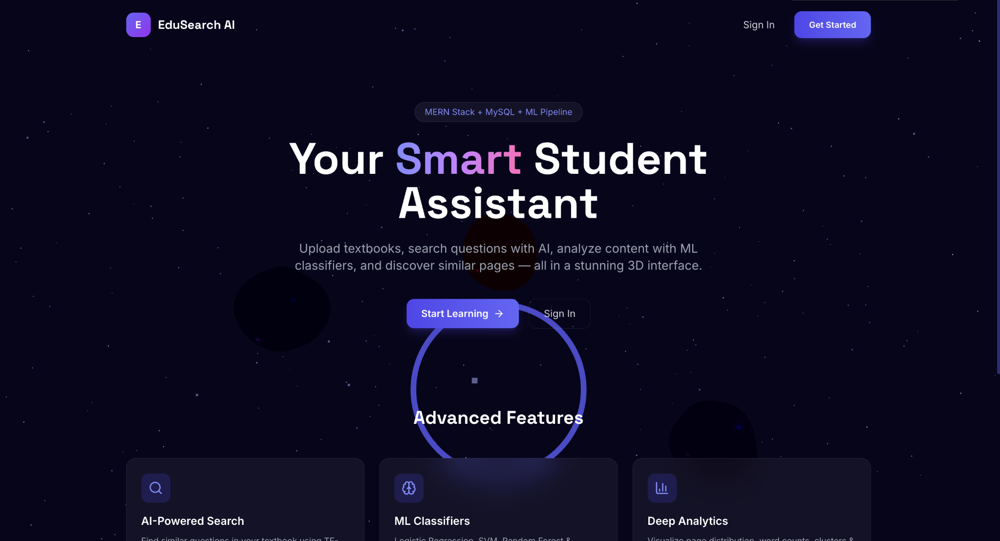
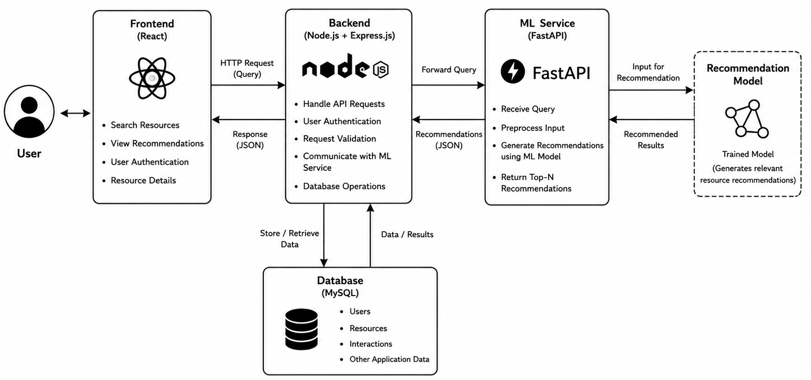
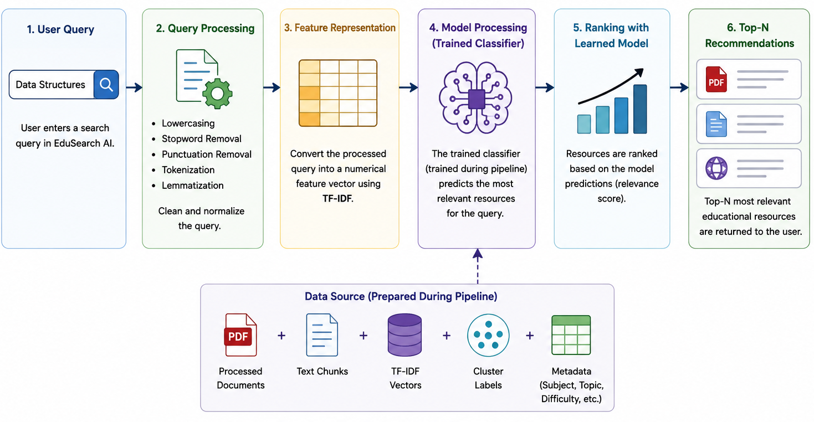
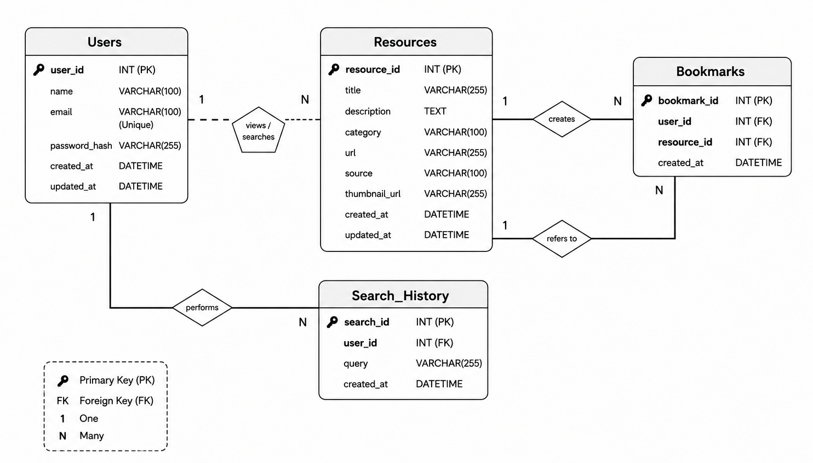
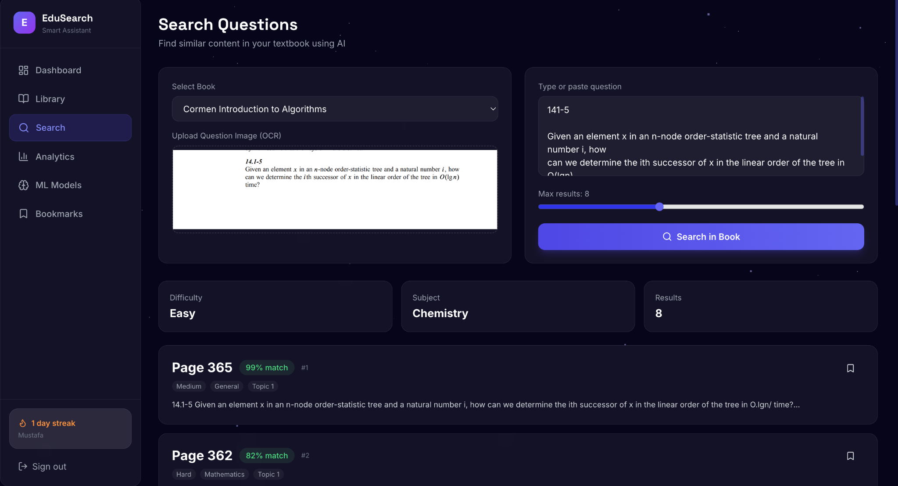
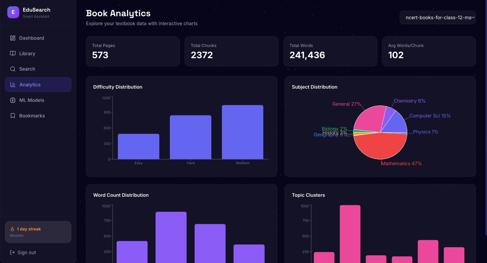

# 🎓 EduSearch AI — Smart Student Assistant

<p align="center">
  <b>An AI-powered educational search and learning platform built with React, Node.js, MySQL, and Python ML.</b>
</p>

<p align="center">
  
</p>

---

## 📌 Overview

**EduSearch AI** is a full-stack Smart Student Assistant designed to help students search and explore educational content from their textbooks.

Users can upload PDF textbooks, search for questions using normal text or an image, discover similar content, view analytics, bookmark useful resources, and receive study recommendations.

The project combines:

- ⚛️ React + Vite for the frontend
- 🟢 Node.js + Express.js for the backend
- 🐬 MySQL + Sequelize for data storage
- 🐍 Python + FastAPI for the ML microservice
- 🤖 Scikit-learn and XGBoost for machine learning
- 🔎 TF-IDF + SVD + K-Means + KNN for intelligent search
- 🖼️ Tesseract OCR for image-based question search
- 🔐 JWT + bcrypt for authentication
- ⚡ Socket.IO for real-time processing progress
- 🌌 Three.js for the interactive 3D UI

---

## ✨ Key Features

### 📚 Intelligent Textbook Search
- Upload PDF textbooks.
- Extract and process textbook content.
- Split documents into searchable text chunks.
- Search questions using natural text.
- Retrieve the most relevant textbook sections.

### 🖼️ OCR-Based Search
Users can upload an image containing a question.

The system:

**Image → OCR → Extracted Text → Text Processing → Search → Relevant Results**

Tesseract OCR is used to extract text from the uploaded image.

### 🤖 Machine Learning Pipeline
The ML service uses:

- TF-IDF Vectorization
- Truncated SVD
- K-Means Clustering
- K-Nearest Neighbors
- Logistic Regression
- Naive Bayes
- Linear SVM
- Random Forest
- XGBoost

The trained models are used for content classification, analytics, and intelligent retrieval.

### 📊 Book Analytics
The application provides analytics such as:

- Total pages
- Total chunks
- Total words
- Average words per chunk
- Difficulty distribution
- Subject distribution
- Word-count distribution
- Topic clusters
- ML model metrics

### 🔖 Study Features
- Search history
- Bookmarks
- Notes
- Study streak tracking
- Personalized study recommendations
- Multi-book library

### 🔐 Authentication
- User registration
- Login
- JWT authentication
- Password hashing with bcrypt
- User-specific books and search data

### ⚡ Real-Time Processing
When a large textbook is uploaded, the ML indexing process runs asynchronously.

**React → Express → FastAPI → ML Pipeline**

Socket.IO is used to communicate processing progress back to the frontend.

---

# 🏗️ System Architecture

<p align="center">
  
</p>

### Architecture Flow

```text
User
  ↓
React Frontend
  ↓ HTTP Request
Node.js + Express Backend
  ├──→ MySQL Database
  │
  └──→ Python FastAPI ML Service
            ↓
       ML Pipeline / Models
            ↓
       Recommendations / Search Results
            ↓
       Express Backend
            ↓
       React Frontend
```

### Why separate the ML service?

The project separates the Python ML workload from the Node.js backend because:

1. Node.js/Express handles APIs, authentication, database operations and application logic.
2. Python provides the ML ecosystem used by the project.
3. ML processing can be scaled independently.
4. A separate ML API makes the models reusable by other clients.
5. Failure in the ML service does not have to stop normal application functionality.

---

# 🧠 Machine Learning Pipeline

<p align="center">
  
</p>

The search pipeline can be summarized as:

```text
User Query
    ↓
Text Preprocessing
    ↓
TF-IDF Feature Representation
    ↓
Trained ML Models
    ↓
Similarity / Relevance Ranking
    ↓
Top-N Results
```

### 1. Text Preprocessing

The input text is cleaned and normalized using operations such as:

- Lowercasing
- Unicode normalization
- Punctuation/character normalization
- Tokenization
- Stop-word handling
- Whitespace normalization

### 2. TF-IDF

TF-IDF converts text into numerical vectors.

The project uses TF-IDF with:

- `max_features = 5000`
- `ngram_range = (1, 2)`
- `max_df = 0.85`
- `min_df = 2`
- `sublinear_tf = True`

### 3. Dimensionality Reduction

Truncated SVD is applied to reduce the dimensionality of the TF-IDF representation.

### 4. K-Means Clustering

K-Means groups similar textbook chunks into clusters.

### 5. KNN Retrieval

The system uses nearest-neighbor retrieval to find relevant textbook chunks for a query.

### 6. ML Classifiers

The project trains multiple classifiers for educational metadata/classification:

- Logistic Regression
- Random Forest
- XGBoost
- Multinomial Naive Bayes
- Linear SVM

### 7. Top-N Results

The retrieved chunks are ranked and the most relevant results are returned to the user.

---

# 🗄️ Database Design

<p align="center">
  
</p>

The MySQL database stores application and learning-related information.

Main entities include:

| Table | Purpose |
|---|---|
| `Users` | Stores user account information |
| `Resources` | Stores educational resource information |
| `Search_History` | Stores user search queries |
| `Bookmarks` | Stores bookmarked resources |

The backend uses **Sequelize ORM** to communicate with MySQL.

---

# 🔄 Request Flow

## Text Search

```text
1. User enters a question
          ↓
2. React sends HTTP request
          ↓
3. Express validates request
          ↓
4. Express calls FastAPI ML service
          ↓
5. ML service preprocesses query
          ↓
6. Query is transformed using fitted TF-IDF/SVD
          ↓
7. Similar textbook chunks are retrieved
          ↓
8. Results are returned as JSON
          ↓
9. Express logs search history
          ↓
10. React displays results
```

## OCR Search

```text
Image
  ↓
Tesseract OCR
  ↓
Extracted Question
  ↓
Text Preprocessing
  ↓
TF-IDF / ML Search Pipeline
  ↓
Relevant Textbook Results
```

---

# 🖥️ Project Screenshots

## 🏠 Landing Page

<p align="center">
  
</p>

The landing page introduces EduSearch AI and provides access to the authentication and learning workflow.

---

## 🔐 User Registration

<p align="center">
  
</p>

Users can create an account before accessing their personalized learning workspace.

---

## 🔎 AI-Powered Search

<p align="center">
  
</p>

The search interface supports:

- Selecting a textbook
- Entering a question
- Uploading a question image
- OCR-based search
- Setting the maximum number of results
- Viewing predicted difficulty and subject
- Viewing similarity/relevance results
- Bookmarking useful results

---

## 📊 Book Analytics

<p align="center">
  
</p>

The analytics dashboard provides visual information about the selected textbook, including difficulty, subject, word count and topic-cluster distributions.

---

# 🧩 Application Modules

```text
EduSearch AI
│
├── Authentication
│   ├── Register
│   ├── Login
│   └── JWT Authorization
│
├── Book Management
│   ├── PDF Upload
│   ├── Text Extraction
│   └── Book Library
│
├── Search
│   ├── Text Search
│   ├── OCR Search
│   ├── Similarity Retrieval
│   └── Top-N Results
│
├── Machine Learning
│   ├── TF-IDF
│   ├── SVD
│   ├── K-Means
│   ├── KNN
│   └── Classification Models
│
├── Analytics
│   ├── Difficulty Distribution
│   ├── Subject Distribution
│   ├── Word Count
│   └── Topic Clusters
│
└── Study Tools
    ├── Search History
    ├── Bookmarks
    ├── Notes
    └── Recommendations
```

---

# 🔌 API Endpoints

| Method | Endpoint | Description |
|---|---|---|
| `POST` | `/api/auth/register` | Create account |
| `POST` | `/api/auth/login` | Sign in |
| `GET` | `/api/books` | List user's books |
| `POST` | `/api/books/upload` | Upload PDF and build index |
| `POST` | `/api/search/text` | Text-based search |
| `POST` | `/api/search/ocr` | OCR image search |
| `GET` | `/api/search/analytics/:bookId` | Book analytics |
| `GET` | `/api/search/metrics/:bookId` | ML model metrics |
| `GET` | `/api/search/recommendations` | Study recommendations |

---

# 📁 Project Structure

```text
EduSearch_AI/
│
├── client/                 # React + Vite + Three.js frontend
│
├── server/                 # Node.js + Express backend
│   ├── controllers/
│   ├── middleware/
│   ├── models/
│   ├── routes/
│   ├── services/
│   └── config/
│
├── ml-service/             # Python FastAPI ML microservice
│
├── core/                   # Shared ML / PDF / OCR modules
│
├── models/                 # Trained ML models and artifacts
│
├── utils/                  # Utility and analytics functions
│
├── database/               # MySQL initialization scripts
│
├── app.py                  # Legacy Streamlit application
│
├── docker-compose.yml
│
└── README.md
```

---

# 🛠️ Tech Stack

| Layer | Technology |
|---|---|
| Frontend | React 18, Vite |
| UI | Tailwind CSS, Framer Motion, Three.js |
| Charts | Recharts |
| Backend | Node.js, Express.js |
| API Communication | HTTP / Axios |
| Real-Time Communication | Socket.IO |
| Authentication | JWT, bcrypt |
| ORM | Sequelize |
| Database | MySQL 8 |
| ML Service | Python, FastAPI |
| ML | scikit-learn, XGBoost |
| NLP | TF-IDF, text preprocessing |
| PDF Processing | pdfplumber |
| OCR | Tesseract, Pillow |
| Legacy UI | Streamlit |

---

# ⚙️ Installation

## Prerequisites

Make sure the following are installed:

- Node.js 18+
- Python 3.10+
- MySQL 8.0 or Docker
- Tesseract OCR
- libomp for XGBoost on macOS

### macOS

```bash
brew install tesseract
brew install libomp
```

---

## 1. Clone the Repository

```bash
git clone https://github.com/Mustafa-Sethji/EduSearch_AI.git
cd EduSearch_AI
```

---

## 2. Start MySQL

Using Docker:

```bash
docker compose up -d mysql
```

Or use a local MySQL installation and create:

```text
edusearch
```

---

## 3. Install Dependencies

```bash
npm run install:all
pip install -r ml-service/requirements.txt
```

---

## 4. Configure Environment Variables

```bash
cp server/.env.example server/.env
```

Then configure the MySQL credentials and other required environment variables.

---

## 5. Run the Application

### Terminal 1 — ML Service

```bash
cd ml-service
uvicorn main:app --reload --port 8000
```

### Terminal 2 — Express Backend

```bash
cd server
npm run dev
```

### Terminal 3 — React Frontend

```bash
cd client
npm run dev
```

Or run the services together if the project dependencies include `concurrently`:

```bash
npm run dev
```

---

# 🌐 Local Development URLs

| Service | URL |
|---|---|
| React Frontend | `http://localhost:5173` |
| Express Backend | `http://localhost:5000` |
| FastAPI ML Service | `http://localhost:8000` |
| MySQL | `localhost:3306` |

---

# 🧪 Legacy Streamlit Version

The original Streamlit implementation is still available.

```bash
streamlit run app.py
```

---

# 🚀 Future Improvements

Possible future improvements include:

- Semantic embeddings using transformer models
- Better personalized recommendations
- More advanced question understanding
- Improved OCR for handwritten questions
- Cloud deployment
- Model monitoring and retraining
- More educational datasets
- Support for additional document formats

---

# 👨‍💻 Author

**Mustafa Sethji**

EduSearch AI — Smart Student Assistant

---

<p align="center">
  Built with React ⚛️ · Node.js 🟢 · MySQL 🐬 · Python 🐍 · Machine Learning 🤖
</p>
